  

<h1 align="center">Ferbin / FERBIN12</h1>

  

<i>Calm surface. Precise machinery.</i>

---

## Overview

<table>
  <tr>
    <td valign="top" width="50%">
      <strong>Primary focus</strong> 
      Robotics simulation, teleop, perception, navigation, and launch tooling.
        
      <strong>Secondary focus</strong> 
      Product software, dashboards, and the internal tooling needed to keep systems shipping.
        
      <strong>Work style</strong> 
      Direct, disciplined, and strongly biased toward systems that are testable and reproducible.
    </td>
    <td valign="top" width="50%">
      <strong>Current stack</strong> 
      ROS 2 Jazzy, Isaac Sim 5.1.0, RealSense, Nav2, TF2, Next.js, Supabase, Python, C++, Rust.
        
      <strong>Build systems</strong> 
      `colcon`, `ament_cmake`, CMake, Docker, Git, Linux, Ubuntu.
        
      <strong>UI systems</strong> 
      React, Electron, Tailwind CSS, Framer Motion, Leaflet, Playwright.
    </td>
  </tr>
</table>

---

## Robotics First

  
  
  
  
  
  
  
  
  
  
  

- ROS 2 Jazzy workspaces and launch pipelines
- Isaac Sim 5.1.0 simulation and teleoperation flows
- TurtleBot3 bringup, teleop, navigation, and description stacks
- RealSense and LiDAR sensor integration
- TF2, Nav2, odometry, and control loops
- MAVLink and CAN adjacent field-robotics tooling

---

## Build Layers

  
  
  
  
  
  
  
  
  
  
  
  
  
  
  
  
  
  

---

## Supporting Work

- TensorFlow, TensorBoard, Ultralytics, and Roboflow for vision / ML work
- FastAPI, Flask, Streamlit, and aiohttp for Python services and tooling
- Jupyter, Sphinx, and docs-first workflows for internal project clarity
- Linux, Ubuntu, Rust, Cargo, and rust-analyzer for systems work

---

## Active Systems

- **MDDS AGV Simulation Stack** - Isaac Sim + ROS 2 simulation environment for an autonomous ground vehicle with teleop, sensors, and launch workflows.
- **GalaHub** - premium event vendor booking platform built with Next.js, Supabase, Leaflet, and a multi-step booking flow.
- **Robi** - workspace assistant focused on diagnostics, safety gating, evaluation, and release hygiene.
- **Joey UI** - an Electron + React desktop assistant shell with motion-driven UI work.

---

## What I Care About

- Systems that are reliable under pressure
- Interfaces that make hard things easier to use
- Reproducible builds and clean release paths
- Robotics software that can be tested, explained, and maintained

---

## Work Style

- Direct over flashy
- Stable over clever
- Testable over fragile
- Clean interfaces over unnecessary abstractions

---

## GitHub Activity

  
  

  

---

  

